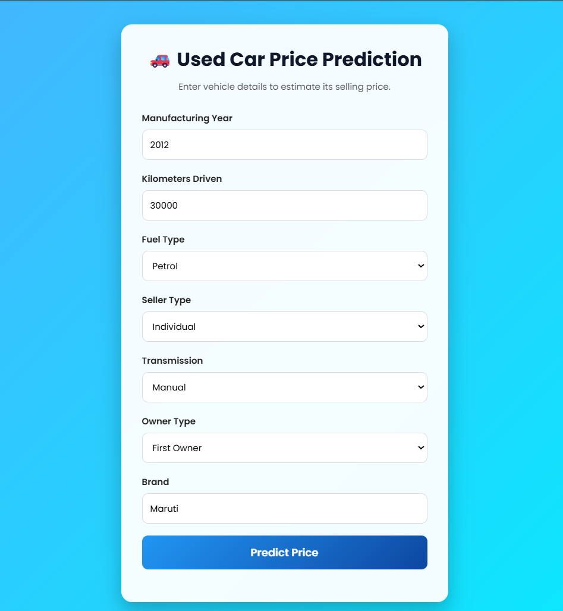
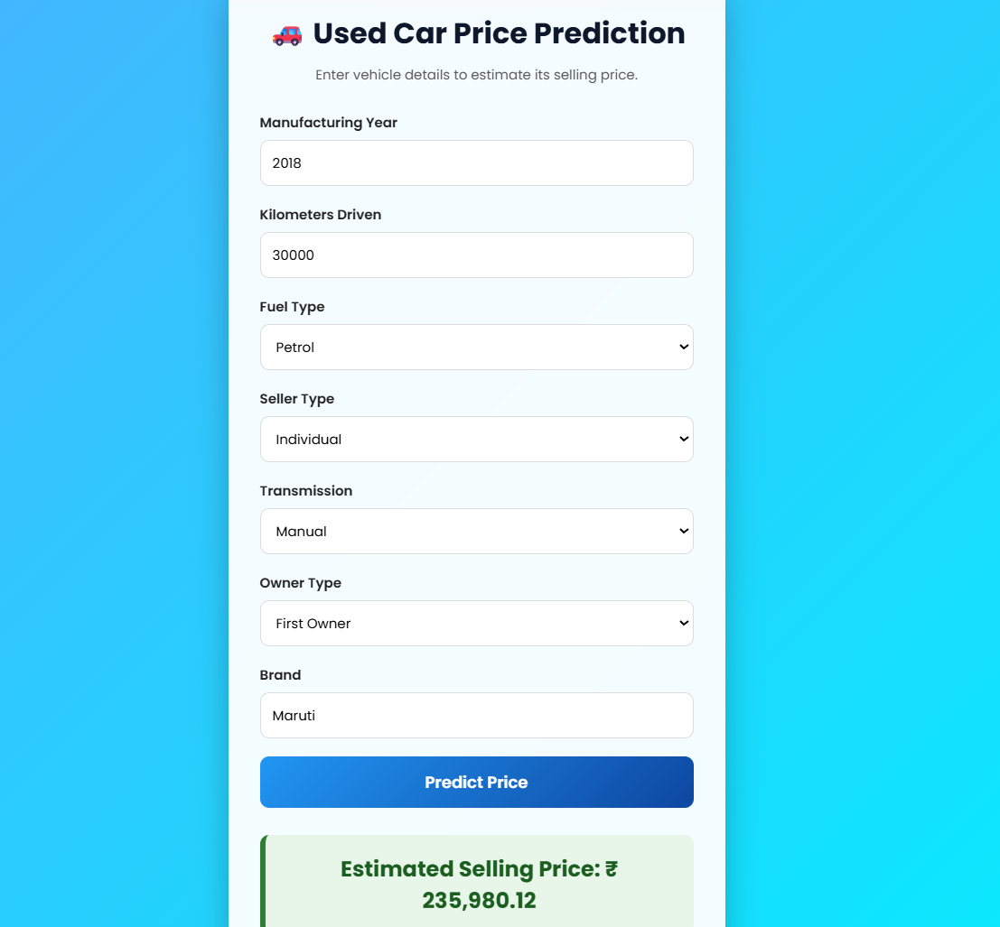

# 🚗 Used Car Price Prediction

## 📌 Project Overview

The **Used Car Price Prediction** project is an end-to-end Machine Learning application that predicts the selling price of a used car based on its specifications. The project follows a complete ML workflow, including data preprocessing, model training, model evaluation, and deployment using **Flask**.

The application allows users to enter vehicle details through a web interface and receive an estimated selling price instantly.


## 🎯 Problem Statement

Determining the fair selling price of a used car can be difficult due to several influencing factors such as:

* Manufacturing year
* Kilometers driven
* Fuel type
* Transmission type
* Seller type
* Owner history
* Vehicle brand

This project aims to build a machine learning model capable of estimating the selling price accurately using these features.

---

## 🚀 Features

* End-to-End Machine Learning Pipeline
* Data Ingestion Module
* Data Preprocessing Pipeline
* Feature Engineering
* Multiple Regression Models
* Automatic Best Model Selection
* Model Evaluation
* Model Serialization using Pickle
* Flask Web Application
* Responsive HTML & CSS User Interface

---

## 📂 Project Structure

```text
Used-Car-Price-Prediction/
│
├── artifacts/
│   ├── model.pkl
│   └── preprocessor.pkl
│
├── data/
│   └── car_data.csv
│
├── notebooks/
│   └── used_car_price_prediction.ipynb
│
├── plots/
│
├── src/
│   ├── __init__.py
│   ├── data_ingestion.py
│   ├── data_preprocessing.py
│   ├── model_trainer.py
│   ├── model_evaluation.py
│   ├── training_pipeline.py
│   └── utils.py
│
├── static/
│   └── style.css
│
├── templates/
│   └── index.html
│
├── app.py
├── requirements.txt
├── setup.py
├── README.md
└── .gitignore
```

---

## 🛠️ Technologies Used

### Programming Language

* Python

### Libraries

* Pandas
* NumPy
* Scikit-learn
* XGBoost 
* Flask
* matplotlib

### Web Framework

* Flask

### Frontend

* HTML
* CSS

### Development Tools

* VS Code
* Git
* GitHub
* Jupyter Notebook

---

## ⚙️ Machine Learning Workflow

```text
Dataset
        │
        ▼
Data Ingestion
        │
        ▼
Data Preprocessing
        │
        ▼
Feature Engineering
        │
        ▼
Model Training
        │
        ▼
Model Evaluation
        │
        ▼
Best Model Selection
        │
        ▼
Save model.pkl & preprocessor.pkl
        │
        ▼
Flask Web Application
```

---

## 📊 Features Used

The model uses the following features:

* Manufacturing Year
* Car Age
* Kilometers Driven
* Fuel Type
* Seller Type
* Transmission
* Owner Type
* Brand

---

## 🤖 Models Trained

The project compares multiple regression algorithms to identify the best-performing model.

Examples include:

* Linear Regression
* K Neighbour Regressor
* Random Forest Regressor
* XGBoost Regressor 

The model with the highest evaluation score is selected and saved.

---

## 📈 Model Evaluation

The trained models are evaluated using regression metrics such as:

* R² Score
* Mean Absolute Error (MAE)
* Mean Squared Error (MSE)
* Root Mean Squared Error (RMSE)

The best-performing model is stored in the `artifacts` folder.

---

## 💻 Running the Project

### Clone the Repository

```bash
git clone https://github.com/anjalimali2312/Used_Car_Price_Prediction.git
```

### Navigate to the Project

```bash
cd Used_Car_Price_Prediction
```

### Create a Virtual Environment

```bash
python -m venv venv
```

### Activate the Virtual Environment

**Windows**

```bash
venv\Scripts\activate
```


### Install Dependencies

```bash
pip install -r requirements.txt
```

---

## ▶️ Train the Model

```bash
python -m src.training_pipeline
```

## Run the Flask Application

```bash
python app.py
```

Open your browser and visit:

```text
http://127.0.0.1:5000
```

---

##  Application Preview





---


##  Author

**Anjali Mali**

GitHub: https://github.com/anjalimali2312

##  Acknowledgements

This project was developed as part of my Machine Learning learning journey to gain hands-on experience in:

* Data preprocessing
* Feature engineering
* Regression modeling
* Model evaluation
* Flask deployment
* End-to-end ML project development
